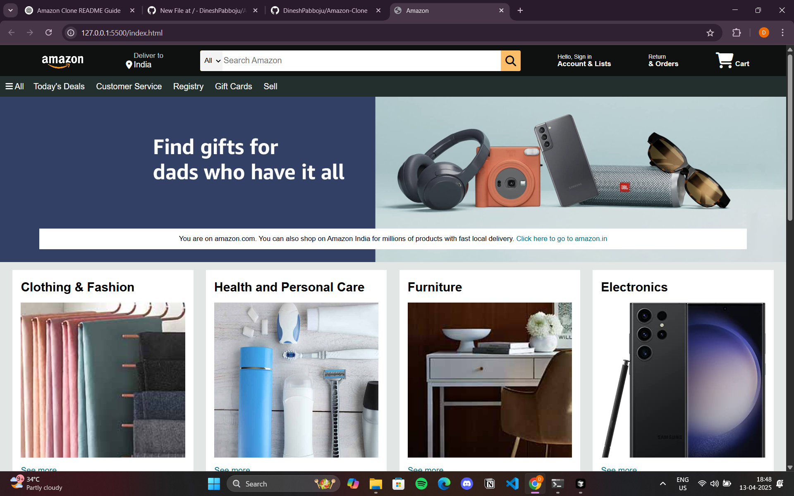

# Amazon Homepage Clone

This is a **clone of the Amazon homepage** built purely using **HTML and CSS**. It mimics the layout and design of the original Amazon website, but does not include any functionality or backend logic.

## 📸 Preview

## 🚀 Features

- Responsive layout similar to Amazon's homepage
- Header with logo, search bar, and navigation
- Banner section with sliding images (static for now)
- Product sections with cards
- Footer with useful links

## 🛠️ Built With

- HTML5
- CSS3 

## 🌐 How to Run Locally

1. Clone the repository: https://github.com/DineshPabboju/Amazon-Clone.git

2. Navigate to the folder:
    cd Amazon-Clone
3. Open index.html in any web browser.

📄 License
This project is for educational purposes only and is not affiliated with Amazon.

